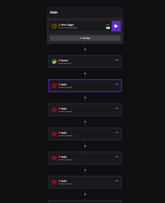

# Vaccine Alerts

**Current # of users:** 24

Receive alerts daily on the percentage of Canadians who have received at least one dose of the COVID-19 Vaccine.

The script that is run periodically is included in this git repository, although I used **WayScript** to run the script every day and **Twilio** to send
the percentage calculated in the script to all users. The API used to access the vaccination data is located at: https://api.covid19tracker.ca/docs/1.0/overview

